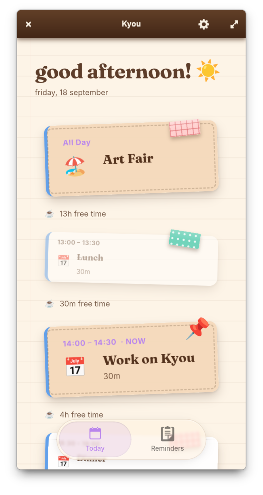
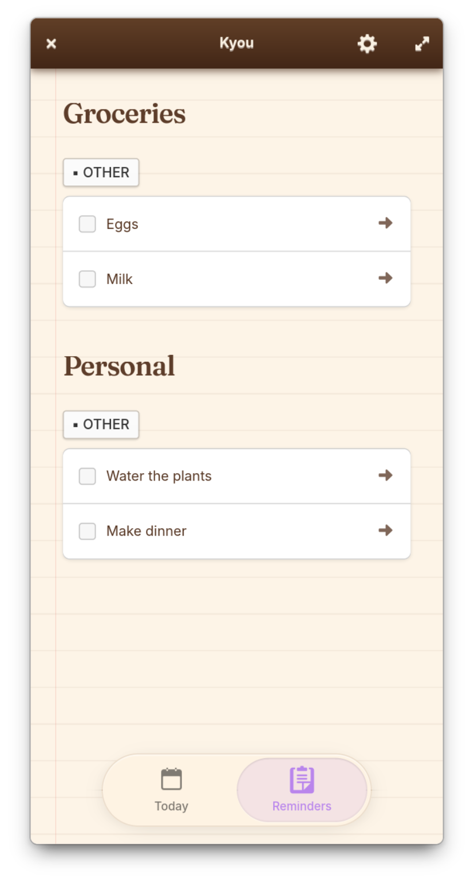

    
    <h1>Kyou</h1>
    
    

Kyou (今日 — "today" in Japanese) is a small app I made to help me manage my tasks for the day.

_(currently it operates read-only, but i'll add read/write support soon!)_

Other apps overwhelmed and confused me with their endless lists and complicated calendar views, so Kyou tries to answer one question when you open it: **what am I meant to be doing right now?**, and puts all the information on one easy-to-understand page.

It pulls everything from the system's calendar and reminders list, meaning you can view the data on other apps and/or devices. This was another major issue I had with the other apps that I used.

## Build instructions

To build the app, clone the repository, and press the play button in GNOME Builder.
